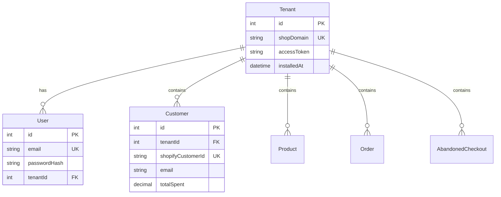
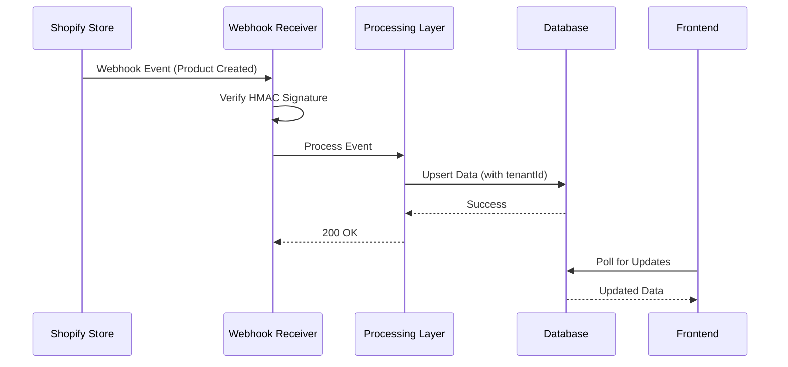
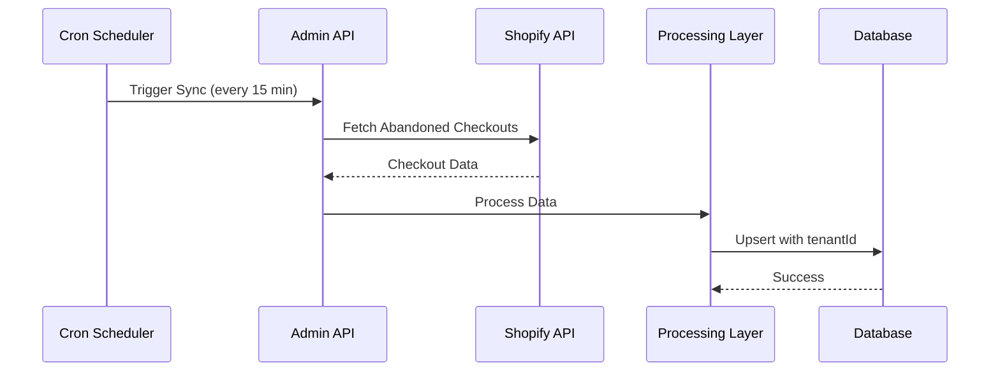
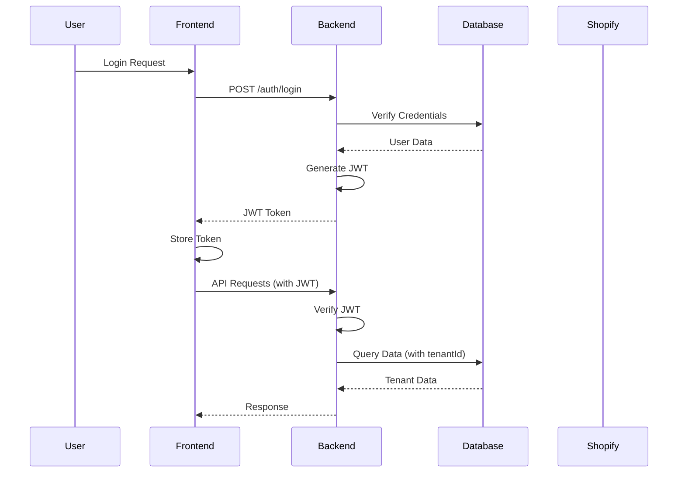
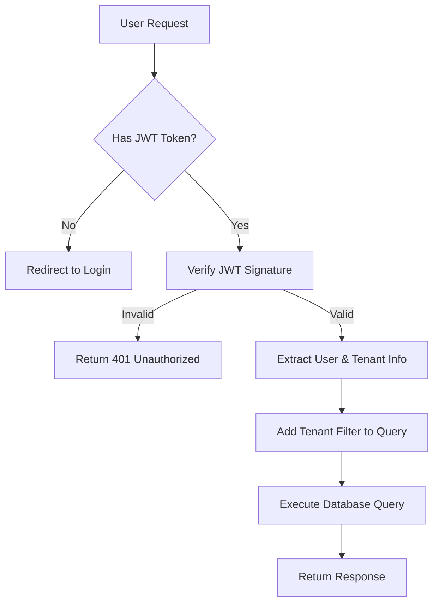
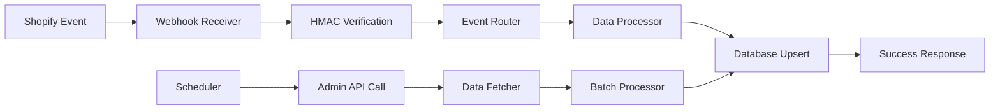
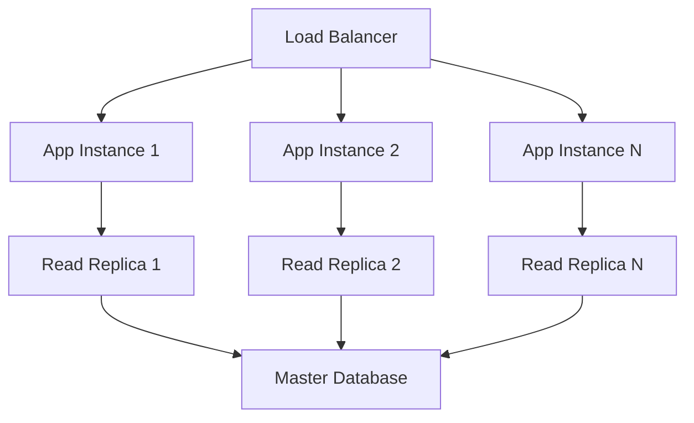
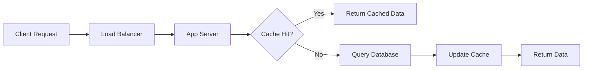
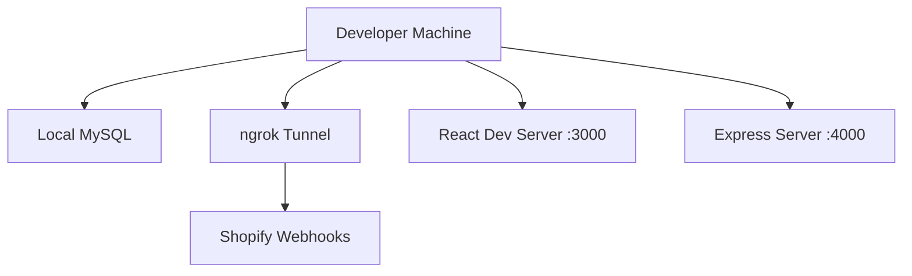
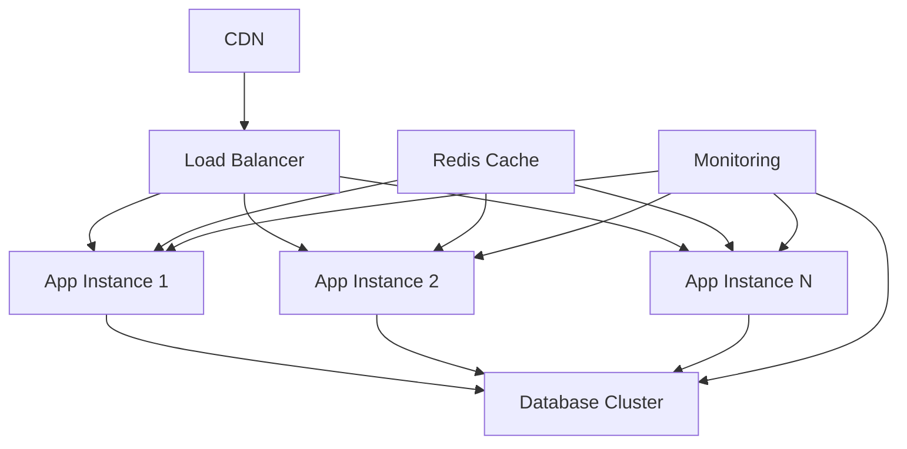

# Architecture Documentation

## 🏗️ High-Level Architecture

The Shopify Data Ingestion & Insights Service is built as a multi-tenant SaaS application that ingests data from Shopify stores and provides analytics dashboards.

```
┌─────────────────────────────────────────────────────────────────┐
│                        CLIENT LAYER                            │
├─────────────────────────────────────────────────────────────────┤
│  Web Browser (React SPA)  │  Mobile App  │  Third-party APIs  │
└─────────────────────────────────────────────────────────────────┘
                                │
                                │ HTTPS/REST API
                                ▼
┌─────────────────────────────────────────────────────────────────┐
│                      APPLICATION LAYER                         │
├─────────────────────────────────────────────────────────────────┤
│  Frontend (React)        │  Backend (Express.js)               │
│  - Dashboard UI          │  - REST API Endpoints               │
│  - Authentication        │  - Authentication & Authorization    │
│  - Data Visualization    │  - Business Logic                    │
│  - State Management      │  - Data Processing                   │
└─────────────────────────────────────────────────────────────────┘
                                │
                                │ Database Queries
                                ▼
┌─────────────────────────────────────────────────────────────────┐
│                       DATA LAYER                               │
├─────────────────────────────────────────────────────────────────┤
│  MySQL Database (Multi-tenant)  │  Redis Cache (Optional)      │
│  - Tenant Isolation             │  - Session Storage            │
│  - Data Persistence             │  - API Response Caching       │
│  - ACID Compliance              │  - Rate Limiting              │
└─────────────────────────────────────────────────────────────────┘
                                │
                                │ External API Calls
                                ▼
┌─────────────────────────────────────────────────────────────────┐
│                    EXTERNAL SERVICES                           │
├─────────────────────────────────────────────────────────────────┤
│  Shopify Admin API      │  Shopify Webhooks    │  Other APIs    │
│  - Data Ingestion       │  - Real-time Updates │  - Integrations│
│  - OAuth Authentication │  - Event Processing  │  - Notifications│
└─────────────────────────────────────────────────────────────────┘
```

## 🏢 Multi-Tenant Architecture

### Tenant Isolation Strategy

The application uses **shared database, shared schema** approach with tenant ID-based isolation:

```sql
-- Every table includes tenantId for isolation
CREATE TABLE customers (
  id INT PRIMARY KEY,
  tenantId INT NOT NULL,
  shopifyCustomerId VARCHAR(255) UNIQUE,
  email VARCHAR(255),
  -- ... other fields
  FOREIGN KEY (tenantId) REFERENCES tenants(id)
);

-- All queries must include tenantId filter
SELECT * FROM customers WHERE tenantId = ?;
```

### Tenant Data Model



## 🔄 Data Flow Architecture

### 1. Real-time Data Ingestion



### 2. Scheduled Data Sync



### 3. User Authentication Flow



## 🛡️ Security Architecture

### Authentication & Authorization



### Data Isolation Layers

1. **Application Level**: All database queries include `tenantId` filter
2. **Database Level**: Foreign key constraints ensure data integrity
3. **API Level**: JWT tokens contain tenant information
4. **Frontend Level**: Tenant selection and data filtering

## 📊 Data Processing Pipeline

### Ingestion Pipeline



### Data Transformation

```javascript
// Example: Shopify Product → Internal Product
const transformProduct = (shopifyProduct, tenantId) => ({
  tenantId,
  shopifyProductId: String(shopifyProduct.id),
  title: shopifyProduct.title || 'Untitled',
  handle: shopifyProduct.handle,
  variants: shopifyProduct.variants || [],
  raw: shopifyProduct, // Store original for reference
  createdAt: new Date(),
  updatedAt: new Date()
});
```

## 🔧 Technology Stack

### Backend Stack

| Component | Technology | Purpose |
|-----------|------------|---------|
| **Runtime** | Node.js 18+ | JavaScript runtime |
| **Framework** | Express.js | Web application framework |
| **Database** | MySQL 8.0+ | Primary data storage |
| **ORM** | Prisma | Database abstraction layer |
| **Authentication** | JWT | Token-based authentication |
| **Scheduling** | node-cron | Task scheduling |
| **HTTP Client** | node-fetch | API requests |

### Frontend Stack

| Component | Technology | Purpose |
|-----------|------------|---------|
| **Framework** | React 18 | UI framework |
| **Build Tool** | Vite | Development server & bundler |
| **Routing** | React Router | Client-side routing |
| **Charts** | Recharts | Data visualization |
| **Styling** | Tailwind CSS | Utility-first CSS |
| **HTTP Client** | Axios | API communication |
| **Icons** | Lucide React | Icon library |

### Database Schema

```sql
-- Core tenant management
CREATE TABLE tenants (
  id INT PRIMARY KEY AUTO_INCREMENT,
  shopDomain VARCHAR(255) UNIQUE NOT NULL,
  accessToken TEXT NOT NULL,
  installedAt TIMESTAMP DEFAULT CURRENT_TIMESTAMP
);

-- User management
CREATE TABLE users (
  id INT PRIMARY KEY AUTO_INCREMENT,
  email VARCHAR(255) UNIQUE NOT NULL,
  passwordHash VARCHAR(255) NOT NULL,
  tenantId INT,
  FOREIGN KEY (tenantId) REFERENCES tenants(id)
);

-- Shopify data (tenant-isolated)
CREATE TABLE customers (
  id INT PRIMARY KEY AUTO_INCREMENT,
  tenantId INT NOT NULL,
  shopifyCustomerId VARCHAR(255) UNIQUE NOT NULL,
  email VARCHAR(255),
  firstName VARCHAR(255),
  lastName VARCHAR(255),
  totalSpent DECIMAL(12,2),
  raw JSON,
  createdAt TIMESTAMP DEFAULT CURRENT_TIMESTAMP,
  FOREIGN KEY (tenantId) REFERENCES tenants(id)
);
```

## 🚀 Scalability Considerations

### Current Architecture Limitations

1. **Single Database Instance**: All tenants share one database
2. **Synchronous Processing**: Webhook processing is blocking
3. **No Caching Layer**: All data fetched from database
4. **Single Application Instance**: No horizontal scaling

### Scalability Improvements

#### 1. Database Scaling


#### 2. Caching Strategy


#### 3. Queue-based Processing
```mermaid
graph TD
    A[Webhook] --> B[Queue (Redis/RabbitMQ)]
    B --> C[Worker 1]
    B --> D[Worker 2]
    B --> E[Worker N]
    
    C --> F[Database]
    D --> F
    E --> F
```

## 🔍 Monitoring & Observability

### Logging Strategy

```javascript
// Structured logging example
const logger = {
  info: (message, meta = {}) => {
    console.log(JSON.stringify({
      level: 'info',
      message,
      timestamp: new Date().toISOString(),
      ...meta
    }));
  },
  
  error: (message, error, meta = {}) => {
    console.error(JSON.stringify({
      level: 'error',
      message,
      error: error.message,
      stack: error.stack,
      timestamp: new Date().toISOString(),
      ...meta
    }));
  }
};
```

### Health Checks

```javascript
// Health check endpoint
app.get('/health', async (req, res) => {
  const health = {
    status: 'ok',
    timestamp: new Date().toISOString(),
    services: {
      database: await checkDatabase(),
      shopify: await checkShopifyAPI(),
      memory: process.memoryUsage(),
      uptime: process.uptime()
    }
  };
  
  res.json(health);
});
```

## 🚀 Deployment Architecture

### Development Environment



### Production Environment



## 🔄 API Design Patterns

### RESTful Endpoints

```javascript
// Resource-based URLs
GET    /api/tenants                    // List tenants
GET    /api/metrics/summary/:tenantId  // Get summary metrics
POST   /api/admin/full-sync/:tenantId  // Trigger sync
GET    /api/metrics/orders-by-date/:tenantId?from=2024-01-01&to=2024-01-31
```

### Error Handling

```javascript
// Consistent error response format
{
  "error": "Validation failed",
  "message": "Email is required",
  "code": "VALIDATION_ERROR",
  "timestamp": "2024-01-15T10:30:00Z",
  "path": "/api/auth/register"
}
```

## 📈 Performance Optimization

### Database Optimization

1. **Indexing Strategy**:
   ```sql
   -- Composite index for tenant queries
   CREATE INDEX idx_customers_tenant_email ON customers(tenantId, email);
   CREATE INDEX idx_orders_tenant_created ON orders(tenantId, createdAt);
   ```

2. **Query Optimization**:
   ```javascript
   // Always include tenantId in WHERE clause
   const customers = await prisma.customer.findMany({
     where: { tenantId }, // Required for multi-tenancy
     take: 10,
     orderBy: { totalSpent: 'desc' }
   });
   ```

### Frontend Optimization

1. **Code Splitting**: Lazy load route components
2. **Memoization**: Use React.memo for expensive components
3. **Virtual Scrolling**: For large data lists
4. **Debounced Search**: Reduce API calls

This architecture provides a solid foundation for a multi-tenant Shopify data ingestion service while maintaining scalability, security, and maintainability.